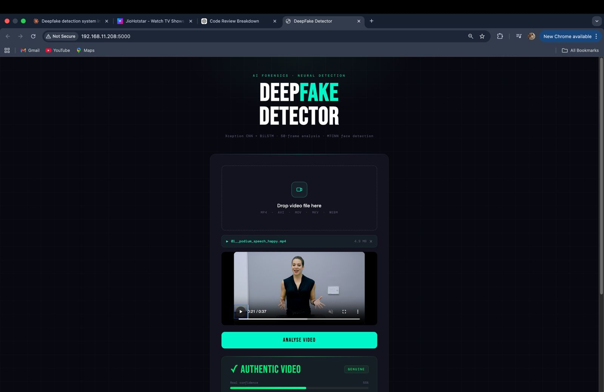
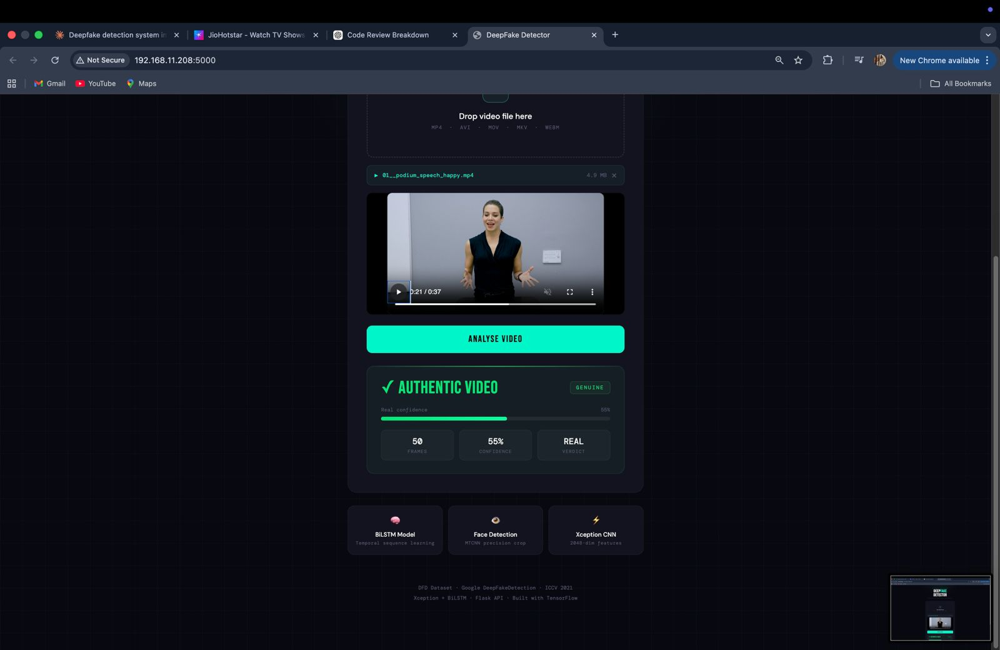

# DEFFO — DeepFake Video Detection using Xception CNN + BiLSTM


An AI-powered DeepFake video detection system that combines **MTCNN face detection**, **Xception CNN feature extraction**, and **Bidirectional LSTM (BiLSTM)** temporal modeling to classify videos as **Real** or **Fake**.

The application provides a modern Flask-based web interface that allows users to upload videos, analyze them, and receive authenticity predictions with confidence scores.

---

# Web Application

## Upload Interface



---

## Prediction Result



---

# Key Features

- Modern responsive Flask web application
- Drag-and-drop video upload interface
- Automatic face detection using MTCNN
- Spatial feature extraction using Xception CNN
- Temporal sequence learning using Bidirectional LSTM
- Confidence score generation
- DeepFake authenticity prediction
- Video preview before analysis
- Responsive dark-themed user interface

---

# Model Performance

| Metric | Value |
|---------|-------|
| ROC-AUC | **83.93%** |
| Accuracy | **67.1%** |
| Fake Recall | **100%** |
| Frames Sampled | **50 Frames / Video** |
| Dataset | Google DeepFakeDetection (Kaggle) |

---

# System Architecture

```text
                Input Video
                     │
                     ▼
        Uniform Frame Sampling (50)
                     │
                     ▼
          MTCNN Face Detection
                     │
                     ▼
      Xception CNN Feature Extraction
             (2048-dimensional)
                     │
                     ▼
      Bidirectional LSTM (BiLSTM)
                     │
                     ▼
            Dense Classification
                     │
                     ▼
          Real / Fake Prediction
```

---

# Technology Stack

| Category | Technology |
|-----------|------------|
| Programming Language | Python |
| Deep Learning | TensorFlow, Keras |
| CNN Backbone | Xception (ImageNet Pretrained) |
| Sequence Model | Bidirectional LSTM |
| Face Detection | MTCNN |
| Computer Vision | OpenCV |
| Backend | Flask |
| Data Processing | NumPy, Pandas |

---

# Project Structure

```text
DeepFake-Video-Detection/
│
├── app.py
├── deepfake_train.py
├── requirements.txt
├── templates/
├── static/
├── images/
└── README.md
```

---

# Installation

## Clone the Repository

```bash
git clone https://github.com/Placidbala/DeepFake-Video-Detection.git

cd DeepFake-Video-Detection
```

## Install Dependencies

```bash
pip install -r requirements.txt
```

## Run the Application

```bash
python app.py
```

Open your browser and visit:

```
http://127.0.0.1:5000
```

---

# Workflow

1. Upload a video through the web application.
2. Extract 50 uniformly sampled frames.
3. Detect faces using MTCNN.
4. Extract spatial features using Xception CNN.
5. Capture temporal information using Bidirectional LSTM.
6. Classify the video as **Real** or **Fake**.
7. Display the prediction with a confidence score.

---

# Contributors

## Bala Subrahmanyam

- Co-developed the DeepFake detection system.
- Contributed to model development, experimentation, evaluation, documentation, web application integration, testing, and overall system implementation.

**GitHub:** https://github.com/Placidbala

**LinkedIn:** https://www.linkedin.com/in/bala-subrahmanyam-5b9643219/

---

## Anant Barjatya

- Co-developed the DeepFake detection system.
- Contributed to model development, experimentation, evaluation, documentation, web application integration, testing, and overall system implementation.

**GitHub:** https://github.com/anantbarjatya

---

# Collaboration

This project was collaboratively developed by **Bala Subrahmanyam** and **Anant Barjatya** as part of an academic deep learning project. Both contributors actively participated in the design, implementation, experimentation, testing, and refinement of the complete system.

---

# Future Scope

- Improve generalization using larger DeepFake datasets.
- Integrate Vision Transformers (ViT) for feature extraction.
- Explore Transformer-based temporal modeling.
- Support real-time webcam DeepFake detection.
- Deploy the application using Docker and cloud platforms.
- Optimize inference speed for production deployment.

---

# Disclaimer

This project was developed for academic, educational, and research purposes to explore deep learning techniques for multimedia forensics and DeepFake detection.
